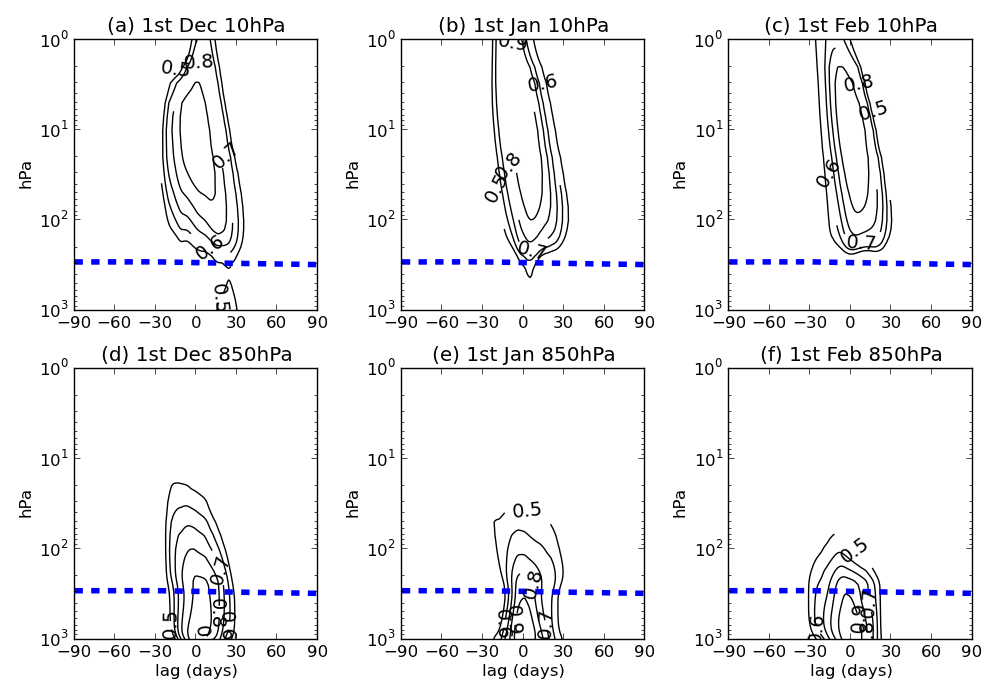

% Seasonal forecasting of the polar stratosphere and its coupling with the troposphere 
% W.J.M. Seviour, S.C. Hardiman, L.J. Gray, N. Butchart, A.A. Scaife

---------------------------------
### Abstract {-}
Recent improvements in global climate modelling have enabled skillful prediction of large scale weather features several months in advance. It has been hypothesised that these developments are, in part, attributable to an improved representation of the stratosphere and its coupling to the troposphere.  Here we examine the predictability of the stratospheric circulation at seasonal lead times using the Met Office Global Seasonal forecast System 5 (GloSea5). We find low predictability in the winter Northern Hemisphere stratosphere but highly significant skill in the springtime Southern Hemisphere stratosphere. This allows for skillful forecasts of column ozone quantities up to three months in advance. We extend the analysis to explore the possible impact of this improved stratospheric forecast on the Southern Hemisphere troposphere, and find unprecedented skill in the prediction of the Southern Annular Mode. By studying the behaviour of forecast skill as a function of time and height, we propose that stratosphere-troposphere coupling is an important mechanism for generating this skill. 

\newpage

# Introduction #

Accurate seasonal forecasting relies on the presence of low-frequency signals in the climate system which are sufficiently predictable and affect the atmospheric circulation. Such signals include the equatorial phenomena of the El Ni&ntilde;o-Southern Oscillation (ENSO) and the Quasi-Biennial Oscillation (QBO). There is now a body of literature which has shown that anomalies associated with ENSO [@Bell2009; @Ineson2009; @Hurwitz2011] and the QBO [@Marshall2009; @Garfinkel2011] can be communicated to the extratropical troposphere via a stratospheric pathway. This proposed pathway is through a  modulation of planetary wave activity, affecting the strength of the stratospheric polar vortex, which in turn exerts a downwards influence on tropospheric annular mode variability.

In the Northern Hemisphere (NH) stratosphere-troposphere coupling is dominated by events in which the stratospheric polar vortex breaks down, known as stratospheric sudden warming (SSW) events [e.g., @Baldwin2001a; @Mitchell2013]. In contrast, in the Southern Hemisphere (SH) there has been just one observed SSW (in 2002). Despite this, @Thompson2005 found significant tropospheric anomalies following 15 smaller-amplitude stratospheric polar vortex events during the SH spring. Interannual variability of the springtime SH stratospheric polar vortex is also of interest because it largely controls interannual variability of the extent of the Antarctic ozone hole, which is present at this time of year [@Salby2011].

These observations have caused interest in the potential for increased skill in medium-range weather forecasting through a better representation of the stratosphere. While improvements have been found on timescales of one week to one month [@Charlton2003; @Kuroda2008, @Marshall2010, @Roff2011], relatively little skill has been found on seasonal timescales. Indeed, @Maycock2011 found a poor representation of the general circulation of the stratosphere in five contemporary seasonal forecasting systems.  More recently, however, @Scaife2013 have found an unprecedented level of skill in the seasonal forecasting of the wintertime North Atlantic, which they propose may be partly attributable to an improved representation of the stratosphere or increased ocean resolution in their model. In this paper, we extend the analysis of @Scaife2013 to investigate the predictability of the stratosphere in both hemispheres directly, with a particular focus on the Antarctic ozone hole. We proceed to analyse the skill of prediction of SH surface weather, and investigate the importance of stratosphere-troposphere coupling in this result. 

# Seasonal forecast system #

The analysis is based on the results from a set of hindcast (or historical forecast) predictions by the Met Office Global Seasonal forecast System 5 (GloSea5). This system is based upon the HadGEM3 coupled model [@Hewitt2011], with an atmospheric resolution of 0.83$^{\circ}$ longitude by 0.55$^{\circ}$ latitude, 85 quasi-horizontal atmospheric levels and an upper boundary at 85 km. The ocean resolution is 0.25&deg; in longitude and latitude, with 75 quasi-horizontal levels. Scaife et al. (2011) showed that this enhanced ocean resolution led to an improved simulation of the North Atlantic ocean and more realistic winter blocking frequency. A 15-member ensemble of hindcasts was run for each year in the period 1996-2009. The hindcast length is approximately four months from three separate start dates spaced two weeks apart, with 5 members initialised on each start date. Members initialised on the same start date differ only by stochastic parameterization of model physics [@Tennant2011]. Hindcasts initialised near November 1st (25/10, 01/11, 09/11) are analysed for the Northern Hemisphere (NH), and near August 1st (25/7, 01/08, 09/08) for the Southern Hemisphere (SH). 

Initial conditions for the atmosphere and land surface were taken from the ERA-Interim reanalysis [@Dee2011], and initial ocean and sea-ice concentrations from the FOAM data assimilation system [@Storkey2010]. Beyond initialisation the model takes no further observational data, and contains no flux corrections or relaxations to climatology. Ozone concentrations are fixed to observed climatological values averaged over 1994-2005, including a seasonal cycle [@Cionni2011]. 
 
Hindcast accuracy is verified by comparison to the ERA-Interim reanalysis. This provides a ‘clean comparison’ since the hindcasts exactly match ERA-Interim at the initialisation date. Furthermore, ERA-Interim has been demonstrated to have realistic representation of the stratospheric circulation and ozone concentrations that are in close agreement with satellite data [@Dragani2011]. 

# Results #

## Stratospheric polar vortices ## 

The GloSea5 hindcast skill for the SH and NH stratospheric polar vortices is shown in Figure \ref{fig:seas-winds}. The strength of the stratospheric polar vortex is measured by the zonal-mean zonal wind (U) at 60$^{\circ}$ north or south, at 10hPa. Anomalies are defined from the relevant climatology of either GloSea5 or ERA-Interim. For GloSea5, this climatology is calculated from the mean of each day across all ensemble members in all years, while for ERA-Interim the climatology is the mean for each day, smoothed with a 30-day running mean. Results are shown for September-November (SON) averages in the SH and December-February (DJF) averages in the NH, corresponding to a 1-4 month lead time in both cases. The correlation between the GloSea5 ensemble mean and ERA-Interim is much greater for the SH (r=0.74) than the NH (r=0.16). The SH correlation is statistically significant at the 99% confidence level, while that for the NH is not significant above 70% (we use bootstrap non-parametric significance tests throughout this paper). This correlation does not depend strongly on particular years; excluding 2002, the SH correlation remains significant at the 95% level (r=0.57). It is also apparent that the ensemble spread is larger on average for the NH; the mean standard deviation from the ensemble mean is 7.9 ms^-1^ in the NH and 4.7 ms^-1^ in the SH.
    
Two SH stratospheric sudden warming events (in which U becomes easterly before the final warming date) were simulated in the GloSea5 hindcasts, in 1997 and 2002. Given the total of 210 ensemble hindcasts, this suggests a frequency of SH stratospheric sudden warming events of approximately 1/100 years in the current climate. Furthermore, 2002 is the most anomalous year in the GloSea5 hindcasts, with all ensemble members simulating negative anomalies, as well as the most negative ensemble mean. Hence it is possible that the 2002 event was to some degree predictable about two months in advance. It should be noted, however, that both the events simulated by GloSea5 were vortex displacement (wave-1) events, in contrast to the vortex splitting (wave-2) event which occurred in 2002 [@Charlton2005]. 

Figure \ref{fig:seas-winds}(a) also includes the area-weighted mean polar cap total column ozone averaged over SON. This is highly negatively correlated with the SON mean U(r=-0.91 with ERA-Interim U, r=-0.71 with the GloSea5 ensemble mean, both significant at the 99% level). Hence, interannual variability in ozone concentrations is found to be closely related to dynamical variability, in agreement with @Salby2011. Consequently, these results suggest that skillful seasonal forecasts of SH column ozone quantities are possible with a model which lacks interactive ozone chemistry. This skill is at lead times which exceed currently produced ozone forecast products (typically up to 10 days) [@Eskes2002; @Eskes2005]. 

In order to investigate the potential for additional predictability within the GloSea5 system, correlations of the ensemble mean SH SON and NH DJF U anomalies with ERA-Interim as a function of hindcast ensemble size are shown in Figure \ref{fig:ens-hist}(a). This is calculated by randomly sampling smaller sets of hindcasts, and recalculating the correlation each time. Following the analysis of @Sardeshmukh2000, these have been fitted with a theoretical relation and asymptote, which depends only on the signal-to-noise ratio [@Kumar2009]. It appears that for the SH hindcasts, the system is already near the theoretical limit, which implies that additional ensemble members would not improve the ensemble mean correlation. There is more room for improvement in the NH on the other hand, although the asymptote is near r=0.25, so correlations comparable with the SH are not possible in the present system.  This is likely because of the increased internal variability of the NH compared with the SH, reflecting the difference in planetary wave variability in each hemisphere. Figure \ref{fig:ens-hist}(b) is rank histogram for stratospheric polar vortexUanomalies in the NH and SH. This sums where the ERA-Interim value lies within the GloSea5 ensemble for each year; from less than all ensemble members (rank 0) to greater than all ensemble members (rank 15). For an ideal ensemble forecast system, it is equally likely that the observed value lies at any rank, resulting in a flat histogram. While the sample size is too small for any highly significant conclusions, this figure suggests that the ensemble may be under-dispersive in the NH and biased towards too positive values in the SH. 

## Stratosphere-troposphere coupling ## 

Because of the lack of significant hindcast skill in the prediction of NH stratospheric polar vortex conditions, the remainder of this paper concerns stratosphere-troposphere coupling in the SH. Figure \ref{fig:sam} presents the time series of the SON mean surface Southern Annular Mode (SAM) index from the GloSea5 hindcasts and ERA-Interim. The SAM represents the dominant mode of hemispheric-scale variability in the SH, and is calculated as the difference of the normalised zonal-mean mean sea-level pressure anomalies from climatology between 40$^{\circ}$S and 65$^{\circ}$S [@Gong1999]. The correlation of the ensemble mean SAM with ERA-Interim is 0.64, which is statistically significant at the 99% level. This is similar to the North Atlantic Oscillation correlation of 0.62 found by Scaife et al. (2013) with GloSea5, and exceeds the level of skill found in other seasonal forecast systems at similar lead times [@Marshall2010; @Lim2013]. 

Several studies have suggested a downwards influence of month-to-month stratospheric anomalies on surface weather regimes in the SH [e.g., @Charlton2005; @Son2013]. It is interesting to consider, therefore, whether the significant stratospheric skill found in the previous section influences this skill at the surface. Figure \ref{fig:sam-corr} presents correlations of the GloSea5 ensemble mean and ERA-Interim smoothed polar cap (60-90$^{\circ}$S) geopotential height anomalies ($Z'$) as a function of time and height. GloSea5 anomalies are calculated with respect to daily climatology, taken as a mean across all ensemble members in all years,  and then smoothed by a 30-day running mean before calculating correlations. 

This correlation is significant in both the troposphere and stratosphere during mid-August, which is to be expected since the hindcasts are initialised with ERA-Interim values near this time. However, while significant correlations remain in the lower stratosphere for about three months, the tropospheric correlation rapidly decays and is not significant throughout September. Interestingly, significant tropospheric correlations then re-emerge in October and persist through to mid-November. 
Also shown in Figure \ref{fig:sam-corr} is the correlation of ERA-Interim $Z'$ at 850 hPa on 1st November with ERA-Interim $Z'$ at all heights and lags over 1979-2009. Significant correlations extend backwards in time into the stratosphere but are insignificant in the troposphere at lags of one month or more. Similar calculations centred around 1st October show much less correlation with stratospheric anomalies, which may be expected due to the reduced stratospheric interannual variability at this time of year. This suggests that it is largely the stratospheric skill in GloSea5 which leads to the re-emergence of tropospheric skill in late October and November. In fact, a simple linear statistical model was constructed, based only on 15th August $Z'$ at 10 hPa, and able to produce statistically significant forecasts of October and November tropospheric $Z'$ (though with less skill than GloSea5). This highlights the need for both accurate observations of stratospheric initial conditions and a good model representation of the stratosphere in seasonal forecasting systems. 

# Summary

The predictability of the NH and SH stratospheric polar vortices has been analysed in the GloSea5 seasonal forecasting system using 14 years of ensemble hindcasts. Significant skill has not been found in the NH winter stratosphere at lead times of 1-4 months. This suggests that the result of Scaife et al. (2013) in forecasting the North Atlantic is not highly influenced by the stratosphere, and ocean resolution or other model improvements may be more significant. 

In contrast, a high level of skill was found for the strength of the SH polar vortex, with a correlation of 0.74 with ERA-Interim values. This suggests that accurate seasonal forecasts of the extent of the Antarctic ozone hole can be made, even with a model which lacks interactive ozone chemistry. Furthermore, significant skill has been found in forecasting the springtime surface SAM, which exceeds that of other contemporary seasonal forecast systems.  This skill exhibits interesting behaviour, being greater in October (lead time 2 months) than September (lead time 1 month). Highly significant skill is found in the lower stratosphere throughout the hindcast simulation. 

It is proposed that this re-emergence of significant skill in the troposphere may arise from the influence of an increase in stratospheric variability in October and November. This hypothesis is supported by observational evidence that SH tropospheric conditions are particularly highly correlated with the stratosphere at this time of year. These results support the proposition of @Son2013 that a well resolved stratosphere would benefit SH seasonal forecasts. They highlight the need for both accurate observations of stratospheric initial conditions and a good model representation of the stratosphere in seasonal forecasting systems.

\newpage

# Figures {-}

![Time series of stratospheric polar vortex (60$^{\circ}$S/N, 10hPa) zonal-mean zonal wind anomalies, averaged over SON for the Southern Hemisphere (a) and DJF for the Northern Hemisphere (b). Dots indicate individual GloSea5 ensemble members, the thick black line the ensemble mean, and the thin red line ERA-Interim. The correlation of the GloSea5 ensemble mean and ERA-Interim is 0.74 in the SH and 0.16 in the NH. Also plotted in (a) is the polar cap (60-90$^{\circ}$S) SON mean total column ozone from ERA-Interim (blue dashed line). \label{fig:seas-winds}](./figures/seas_winds.png)

![(a) Variation with ensemble size (between 1-15) of GloSea ensemble mean correlation with ERA-Interim for stratospheric polar vortex $\overline{U}$ anomalies (thick lines), with a fitted theoretical distribution [Sardeshmukh et al., 2000] (thin lines) and its asymptote (dashed line). (b) Rank histogram of vortex wind anomalies, showing where observed values lie in the ensemble hindcasts. \label{fig:ens-hist}](./figures/ens_hist.png)

![(a) Correlation of GloSea5 ensemble mean polar cap (60-90$^{\circ}$S) geopotential height anomalies ($Z'$) with ERA-Interim values, as a function of time and height for forecasts initialised near 1st August. (b) Correlation of ERA-Interim $Z'$ values with those predicted by the linear statistical model based on $Z'$ at 10 hPa on 15th August. $Z'$ values are smoothed using a 30 moving window. Grey shading indicates regions which not are greater than zero at the 95% confidence interval. The blue dashed line indicates the polar cap mean tropopause level from Wilcox et al., 2012. \label{fig:sam-corr}](./figures/glosea_linear_corr.png)

\newpage

# References # 

